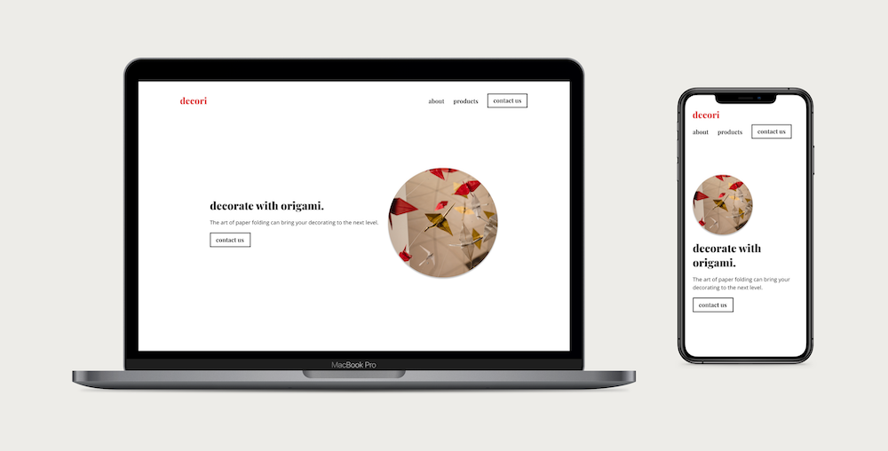
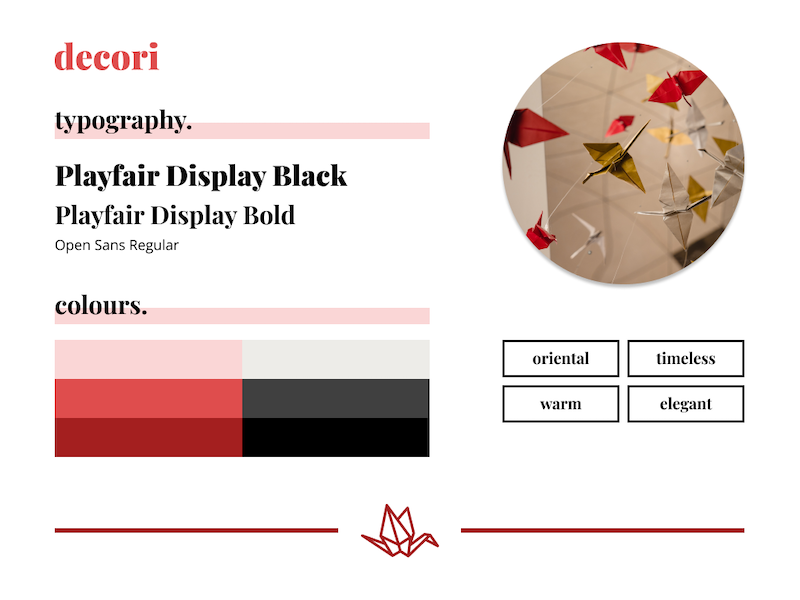
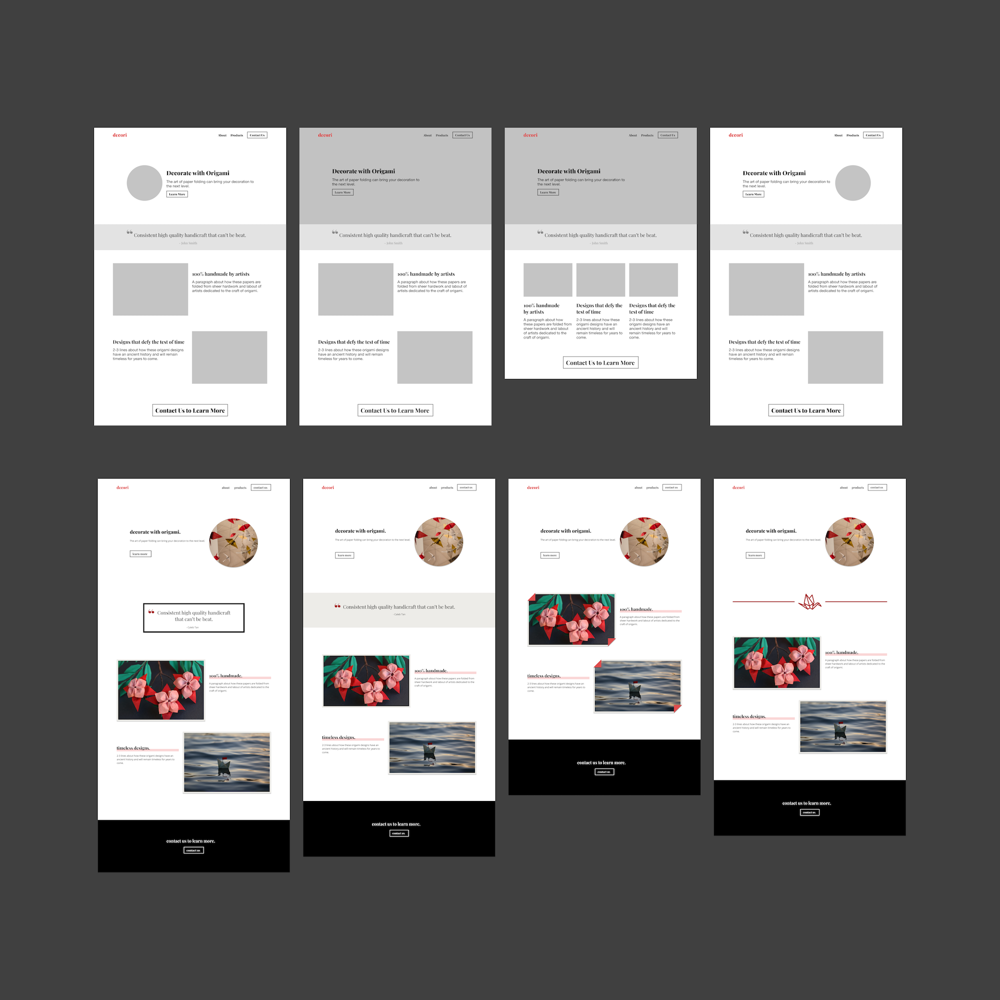
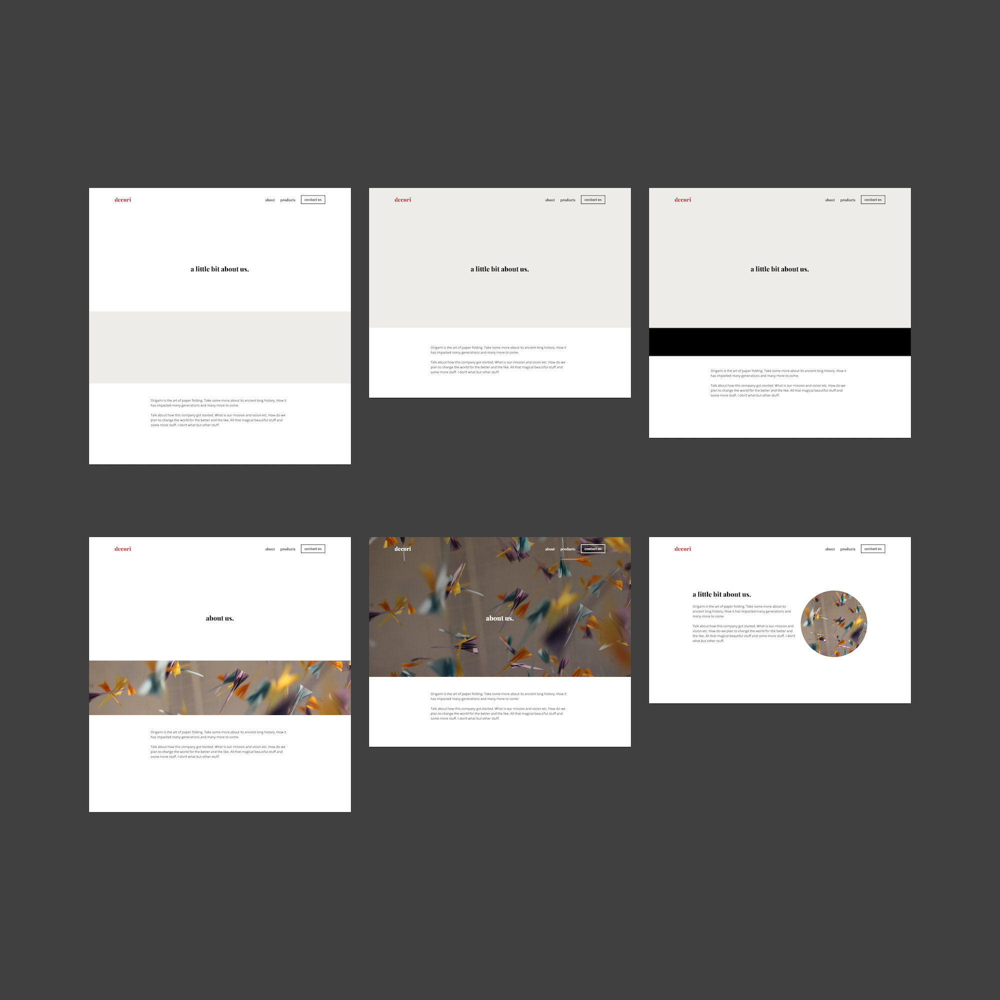
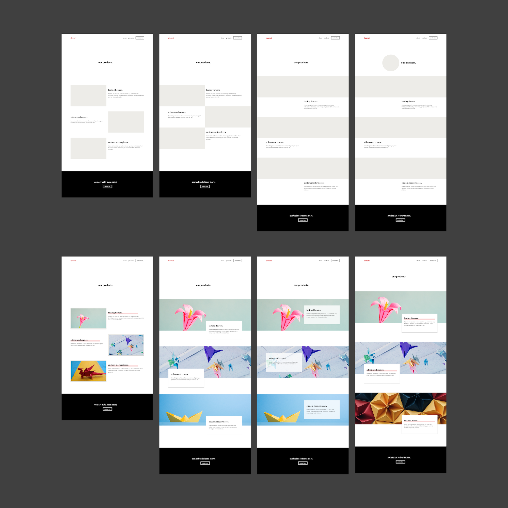
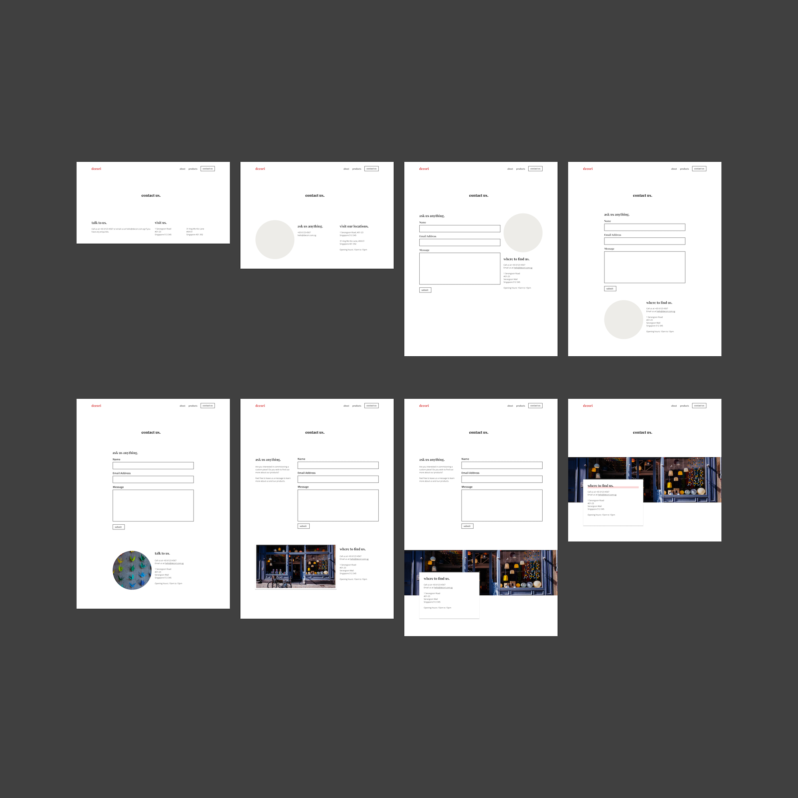
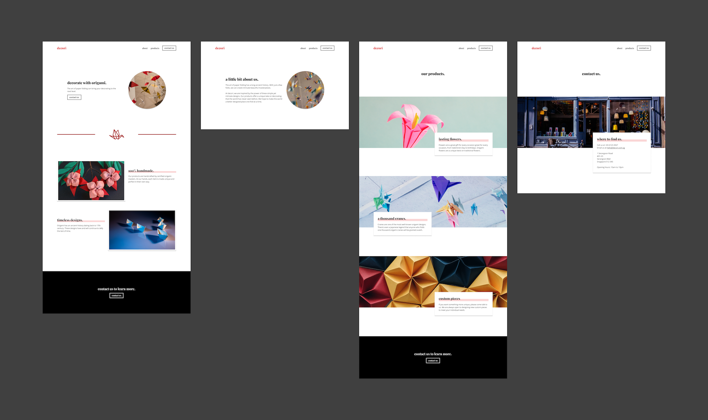

# decori

- This is a marketing website for a fictional company that sells origami decorations
- I created this project to practice my UI design and frontend development skills with a static website
- The live website can be found at [here](https://rtkleong10.github.io/decori/)

## Design Process
### Design System

- Before designing any of the pages, I created a design system to define the overall direction and mood of the website
- Since origami is a Japanese art form with a long history, I wanted to website to evoke a feeling of timelessness and warmth

### Wireframing
- After defining the design system, I started making some rough greyscale wireframes to quickly test out different layouts for each page
- After I settled on some layouts I liked, I expanded on them by creating full-coloured and more high fidelity wireframes

#### Landing Page

- One challenge I faced was creating the divider between the jumbotron and the rest of the page
- I experimented with different dividers before settling on using a crane vector

#### About Page

#### Products Page

- Initially, I tried a similar layout to the landing page for the products page
- However, I realised that the photographs needed to stand out more on the products page since they were the main focus
- So, I modified the layout to make the photographs wider to make them the centre of attention

#### Contact Us Page

- At first, I included a contact form in the contact us page
- However, I found that it looked quite jarring in the full coloured version because it made the page more black and white compared to the other pages
- Hence, I decided to omit it and just include the contact details

## Final Pages

- [Click here](https://rtkleong10.github.io/decori/) to view the live website
